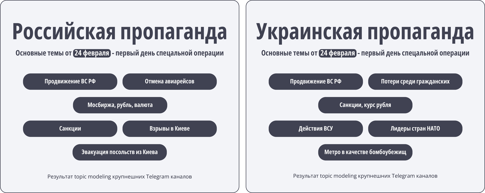
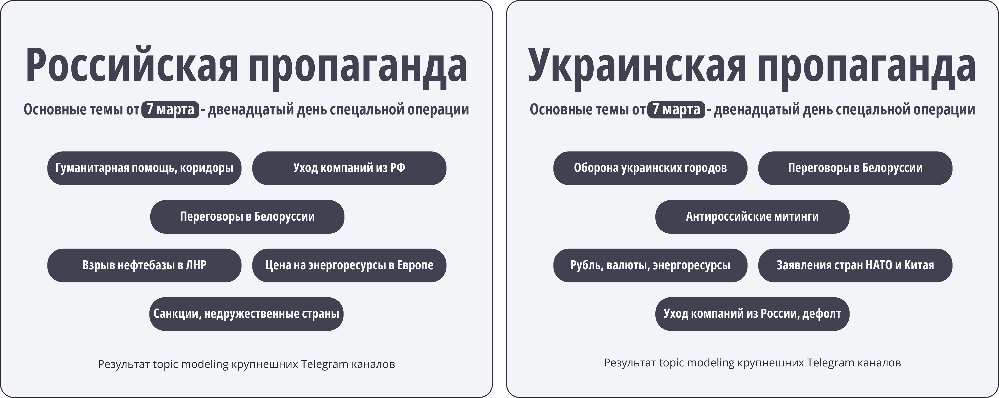
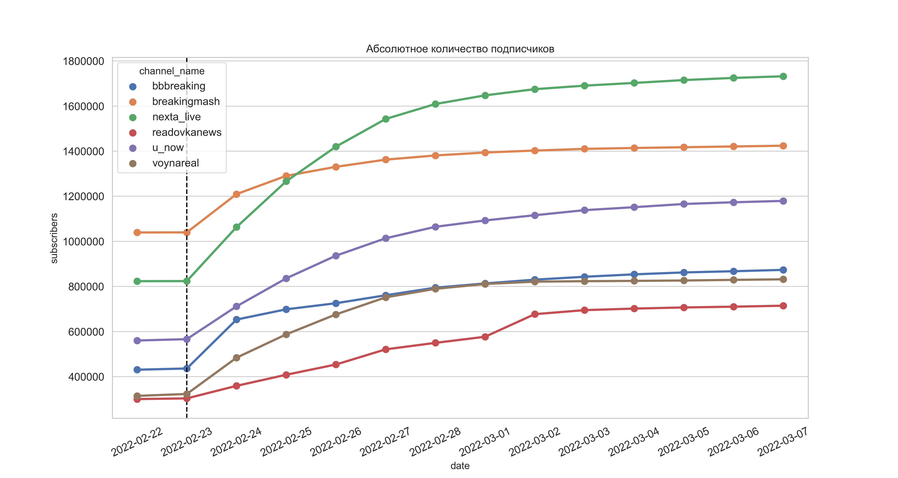

# special_operation_topic_modeling
Репозиторий для хранения файлов, связанных с аналитикой пророссийских и проукраинских телеграм каналов во время проведения специальной операции.

Файл `comments_to_modeling_embeddings.pkl` отсутствует в папке `data/processed` т.к теперь российской долларовой картой нельзя оплатить git lfs. Скачать его можно [с Google Drive](https://drive.google.com/file/d/1A1tShSJ28J_duwr1hfS7fplE8oKuBbLF/view?usp=sharing). 

# 1. Проделанная работа
1. Для крупнейших telegram каналов произведен парсинг постов, комментариев и различных аттрибутов к ним за период с 22 февраля по 8 марта
2. Проведен EDA для выяснения факторов, влияющих на прирост подписчиков в первые дни конфликта
3. Проведены topic modeling и topic representation, выполнено сравнение тезисов пропаганд.
# 2. Структура:
```
├── requirements.txt                                                <- Файл с перечислением зависимых пакетов Python
├── data                                                            <- Данные    
│   ├── raw                                                         <- Сырые
│   ├── processed                                                   <- Обработанные
├── notebooks                                                       <- Jupyter notebooks           
│   ├── 1. telegram_data_collection.ipynb                           <- Парсинг через Telethon
│   ├── 2. exploratory_data_analysis.ipynb                          <- EDA
│   ├── 3. topic_modeling_data_selection.ipynb                      <- Отбор данных для topic modeling
│   ├── 4. sentence_transformers_embeddings_extraction_colab.ipynb  <- Получение бертовых эмбеддингов для отобранных данных
│   ├── 5. topic_modeling_and_representation.ipynb                  <- Topic modeling и topic representation
└── docs                                                            <- Вспомогательные изображения
```
# 3. Результат topic representation


# 4. Абсолютное количество подписчиков с начала конфликта

